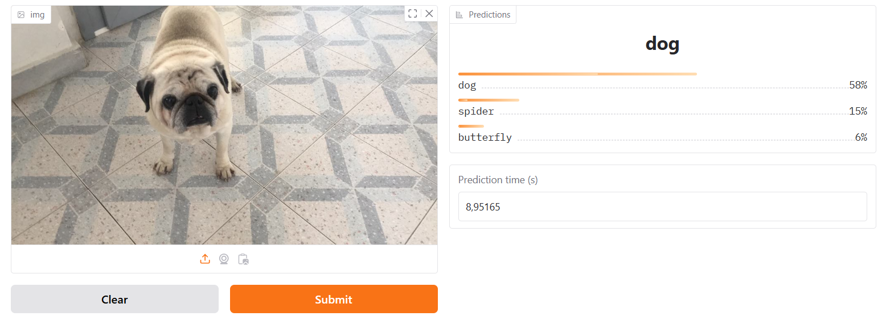

# Animals Classification 
The main goal of this project is to create a model (both using TensorFlow and PyTorch) to classify images of 10 different species of animals. Once we create the best model we can, we deploy our model in production. We use hugging face spaces to deploy model and you can check the app [HERE](https://huggingface.co/spaces/DimitrisKatos/AnimalClassification).

The project currently can classify 10 different species of animals wi the accuracy of 0.9697. The animals that the model can be identify is the following:
1. Dog
2. Cat
3. Horse
4. Butterfly
5. Cow
6. Chicken
7. Sheep
8. Squirrel
9. Elephant
10. Spider

So take a photo of an animal, test the app and let me know the results!!!

# Implementation proecesses.
For this project we use a dataset tha can be found [here](https://www.kaggle.com/datasets/) and consists images of 10 different animals.

The project contains the following:
1. **Data Preprocessing**: In this part we turn the data into a format that is more useful for our project. We also create many different dataset that contains different number of  training, testing and validation images. By doing this, we can create many models based on each dataset.

2. **Modeling with PyTorch**: We are modeling using PyTorch, creating helpful functionalities to `going_modular` folder and we track our experiments in `experiment_tracking_folder`.

3. **Modeling using TensorFlow**: We use TensorFlow to create models with different hyperparameters.

4. **Deploy model**: Deploy the best model in HuggingFace Spaces and check if it works.
